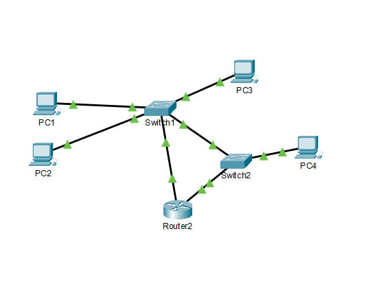
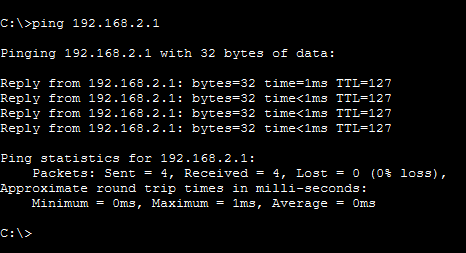
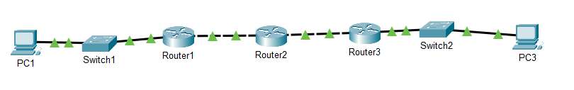
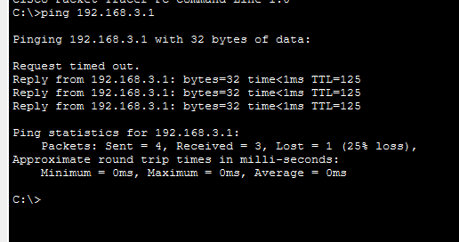

# Неделя 2: IP-адресация и субнетинг

## 1. Что такое IP-адрес

IP-адрес — логический адрес устройства в сети.
Состоит из 4 чисел (октетов), каждое от 0 до 255.
Пример: 192.168.56.102

Всего 32 бита = 4 байта = 4 октета по 8 бит.
192 . 168 . 56 . 102
11000000.10101000.00111000.01100110

## 2. Приватные адреса

Не видны в интернете, используются внутри сетей:

- 10.0.0.0/8       (класс A)
- 172.16.0.0/12    (класс B)
- 192.168.0.0/16   (класс C)

В моей лаборатории:
- Host-only: 192.168.56.0/24
- NAT VirtualBox: 10.0.2.0/24

## 3. Публичные адреса

Всё остальное — публичные адреса. Они видны в интернете.
Выдаются провайдером.

## 4. Перевод IP в двоичный вид

192.168.56.102 = 11000000.10101000.00111000.01100110

10.0.2.15 = 00001010.00000000.00000010.00001111

172.16.0.1 = 10101100.00010000.00000000.00000001

255.255.255.0 = 11111111.11111111.11111111.00000000

## 5. CIDR-нотация

/24 означает: первые 24 бита — сеть, последние 8 — хосты.
В /24 может быть 256 адресов (2^8), из них 254 — для хостов.

/24 — это маска 255.255.255.0
/16 — это маска 255.255.0.0
/8  — это маска 255.0.0.0

## 9. Субнетинг

Субнетинг — разбиение одной сети на несколько маленьких подсетей.

Зачем:
- Безопасность (разные отделы — разные подсети).
- Меньше broadcast-трафика.
- Управляемость.
- Экономия IP.

### Пример: разбить 192.168.56.0/24 на 4 подсети

Шаг 1. Нужно 4 подсети. 4 = 2^2 → добавляем 2 бита к маске.
Новая маска: /26 (24 + 2 = 26).

Шаг 2. 2^(32-26) = 2^6 = 64 адреса в каждой подсети.

Шаг 3. Диапазоны (шаг 64):

| Подсеть | Адрес сети | Первый хост | Последний хост | Broadcast |
|---|---|---|---|---|
| 1 | 192.168.56.0 | 192.168.56.1 | 192.168.56.62 | 192.168.56.63 |
| 2 | 192.168.56.64 | 192.168.56.65 | 192.168.56.126 | 192.168.56.127 |
| 3 | 192.168.56.128 | 192.168.56.129 | 192.168.56.190 | 192.168.56.191 |
| 4 | 192.168.56.192 | 192.168.56.193 | 192.168.56.254 | 192.168.56.255 |

Правило: первый адрес в подсети — сеть, последний — broadcast.
Они не используются для хостов.

### Размеры подсетей

| CIDR | Адресов всего | Хостов | Шаг |
|---|---|---|---|
| /24 | 256 | 254 | 256 |
| /25 | 128 | 126 | 128 |
| /26 | 64 | 62 | 64 |
| /27 | 32 | 30 | 32 |
| /28 | 16 | 14 | 16 |
| /29 | 8 | 6 | 8 |
| /30 | 4 | 2 | 4 |

## 10. Решённые задачи по субнетингу

### Задача 1. 10.0.0.0/24 на 2 подсети (/25)

| Подсеть | Адрес сети | Хосты | Broadcast |
|---|---|---|---|
| 1 | 10.0.0.0/25 | 10.0.0.1 – 10.0.0.126 | 10.0.0.127 |
| 2 | 10.0.0.128/25 | 10.0.0.129 – 10.0.0.254 | 10.0.0.255 |

### Задача 2. IP 192.168.1.100/26

/26 = 64 адреса, шаг 64. Диапазоны: 0–63, 64–127, 128–191, 192–255.
IP .100 попадает в диапазон 64–127.

- Адрес сети: 192.168.1.64
- Broadcast: 192.168.1.127
- Хосты: 192.168.1.65 – 192.168.1.126

### Задача 3. 172.16.0.0/24 на 8 подсетей (/27)

/27 = 32 адреса, шаг 32.

| Подсеть | Адрес сети | Хосты | Broadcast |
|---|---|---|---|
| 1 | 172.16.0.0/27 | .1 – .30 | .31 |
| 2 | 172.16.0.32/27 | .33 – .62 | .63 |
| 3 | 172.16.0.64/27 | .65 – .94 | .95 |
| 4 | 172.16.0.96/27 | .97 – .126 | .127 |
| 5 | 172.16.0.128/27 | .129 – .158 | .159 |
| 6 | 172.16.0.160/27 | .161 – .190 | .191 |
| 7 | 172.16.0.192/27 | .193 – .222 | .223 |
| 8 | 172.16.0.224/27 | .225 – .254 | .255 |

## 11. Packet Tracer — первая топология

(PC1, PC2 — в одной подсети; PC3, PC4 — в другой)

### Настройка IP

| Устройство | IP | Маска | Gateway |
|---|---|---|---|
| PC1 | 192.168.1.1 | 255.255.255.0 | 192.168.1.254 |
| PC2 | 192.168.1.2 | 255.255.255.0 | 192.168.1.254 |
| PC3 | 192.168.2.1 | 255.255.255.0 | 192.168.2.254 |
| PC4 | 192.168.2.2 | 255.255.255.0 | 192.168.2.254 |

### Настройка Router2 (CLI)

enable
configure terminal
interface FastEthernet0/0
ip address 192.168.1.254 255.255.255.0
no shutdown
exit
interface FastEthernet0/1
ip address 192.168.2.254 255.255.255.0
no shutdown
exit
write memory

### Проверка

ping с PC1 (192.168.1.1) на PC3 (192.168.2.1) — работает.
Результат: 4 пакета, 0% потерь.

### Что узнала

- Кабель Copper Straight-Through — для PC↔Switch и Switch↔Router.
- Роутер настраивается через CLI (как настоящий).
- Gateway на PC = адрес роутера в подсети хоста.
- `no shutdown` обязателен — интерфейсы по умолчанию выключены.

### Скриншоты

- Топология: 
- Успешный ping: 

## 12. Задача 4. IP 192.168.100.75/26

/26 = 64 адреса, шаг 64. Диапазоны: 0–63, 64–127, 128–191, 192–255.
IP .75 попадает в диапазон 64–127.

- Адрес сети: 192.168.100.64
- Broadcast: 192.168.100.127
- Хосты: 192.168.100.65 – 192.168.100.126

## 13. Статическая маршрутизация (Packet Tracer)

Топология: 

Схема: PC1 ── Switch1 ── Router1 ── Router2 ── Router3 ── Switch2 ── PC3

Три подсети, три роутера, два коммутатора.
Каждый роутер знает только своих соседей.

### Зачем нужны статические маршруты

Роутер знает только сети, к которым подключён напрямую.
Чтобы он знал чужие сети — прописывают статические маршруты.

Команда:
ip route <сеть> <маска> <следующий хоп>
Пример:
ip route 192.168.3.0 255.255.255.0 10.0.0.2

Читается: «Пакеты в сеть 192.168.3.0/24 → отправляй на 10.0.0.2».

### Маршруты на каждом роутере

**R1:**
ip route 192.168.3.0 255.255.255.0 10.0.0.2

**R2:**
ip route 192.168.1.0 255.255.255.0 10.0.0.1
ip route 192.168.3.0 255.255.255.0 10.0.1.2

**R3:**
ip route 192.168.1.0 255.255.255.0 10.0.1.1

### Таблица маршрутов (show ip route)

- **C** — Connected (напрямую подключена).
- **S** — Static (статический маршрут).
- **R** — RIP, **O** — OSPF, **B** — BGP (динамические протоколы).

### Проверка

PC1 пингует PC3 через 3 роутера — работает.

### Таблица маршрутов (show ip route)

- **C** — Connected (напрямую подключена).
- **S** — Static (статический маршрут).
- **R** — RIP, **O** — OSPF, **B** — BGP (динамические протоколы).

### Проверка

PC1 пингует PC3 через 3 роутера — работает.

Первый пакет теряется — нормально (ARP-таблицы ещё не заполнены).

### Что узнала

- Между двумя роутерами — только **Cross-Over** кабель (не Straight-Through).
- Между роутером и коммутатором — Straight-Through.
- Между PC и коммутатором — Straight-Through.
- Каждый роутер знает только свои сети. Чужие — через статические маршруты.
- R2 (посередине) знает **обе** крайние сети — ему нужно **два** маршрута.
- `show ip route` показывает таблицу маршрутизации.

Первый пакет теряется — нормально (ARP-таблицы ещё не заполнены).

### Что узнала

- Между двумя роутерами — только **Cross-Over** кабель (не Straight-Through).
- Между роутером и коммутатором — Straight-Through.
- Между PC и коммутатором — Straight-Through.
- Каждый роутер знает только свои сети. Чужие — через статические маршруты.
- R2 (посередине) знает **обе** крайние сети — ему нужно **два** маршрута.
- `show ip route` показывает таблицу маршрутизации.
