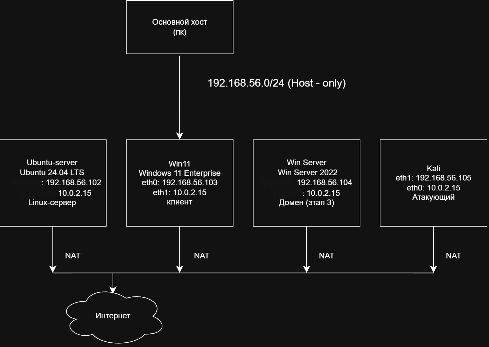

# Homelab

Домашняя лаборатория для изучения Linux, сетей и информационной безопасности.

## Схема сети

## Виртуальные машины

| ВМ | ОС | IP (host-only) | IP (NAT) | Роль |
|---|---|---|---|---|
| ubuntu-server | Ubuntu Server 24.04 LTS | 192.168.56.102 | 10.0.2.15 | Linux-сервер, SSH |
| win11 | Windows 11 Enterprise | 192.168.56.103 | 10.0.2.15 | Клиент |
| winserver | Windows Server 2022 | 192.168.56.104 | 10.0.2.15 | Домен (этап 3) |
| kali | Kali Linux | 192.168.56.105 | 10.0.2.15 | Атакующий |

## Сетевая схема

- **Host-only (192.168.56.0/24)** — внутренняя сеть лаборатории. Все ВМ видят друг друга и хост.
- **NAT** — выход в интернет для обновлений.

## Журнал

Ведётся в [journal.md](journal.md).

## Прогресс по этапам

- [x] Этап 0: инфраструктура (VirtualBox, 4 ВМ, сеть, SSH)
- [ ] Этап 1: базовые сервисы (веб-сервер, файловый сервер)
- [ ] Этап 2: сеть, домен
- [ ] Этап 3: Active Directory, домен
- [ ] Этап 4: безопасность, атаки
