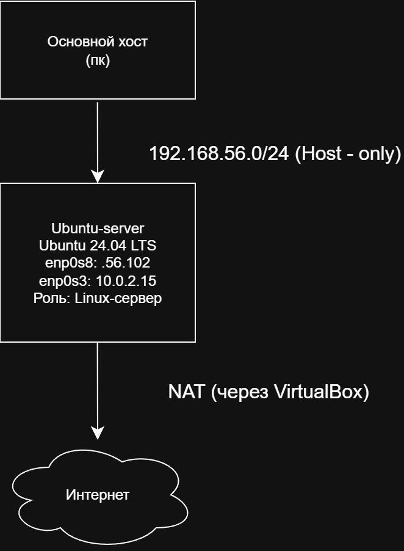

# homelab

Домашняя лаборатория для изучения Linux, сетей и информационной безопасности.

## Схема сети

## Виртуальные машины

| ВМ | ОС | IP (host-only) | IP (NAT) | Роль |
|---|---|---|---|---|
| ubuntu-server | Ubuntu Server 24.04 LTS | 192.168.56.102 | 10.0.2.15 | Linux-сервер, SSH |

## Журнал

Ведётся в [journal.md](journal.md).

## Прогресс по этапам

- [x] Этап 0: инфраструктура (VirtualBox, Ubuntu Server)
- [ ] Этап 1: Windows 10, Windows Server 2022
- [ ] Этап 2: сеть, домен
- [ ] Этап 3: ...
